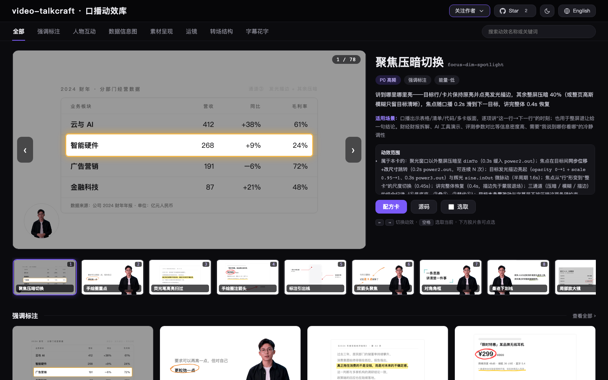

<div align="center">


<h1>video-talkcraft</h1>

[](https://vincentwei1021.github.io/video-talkcraft/)
[](LICENSE)
[](assets/wechat-group.jpg)

**口播视频的 agent skill：字级配音同步 · 78 张动效配方卡 · 七层反 PPT 镜头系统 · 三重验收**

[中文](README.md) | [English](README_EN.md)

</div>

**video-talkcraft** 是 [video-shotcraft](https://github.com/Vincentwei1021/video-shotcraft)
系列的口播视频篇：一个把 Claude Code / Codex 变成口播视频动效工作室的 AI agent skill。
给它一份口播稿和一条成品配音，它在本机对齐字级时间戳、把每个语义拍写进 SHOTBOOK
分镜，然后用 [Remotion](https://www.remotion.dev/) 渲出高质量的解说成片——动态字卡、
证据截图、运镜、素排字幕、影视级音效，全部锁在人声上。

🖼️ [**在线画廊：78 张动效预览一页全览 »**](https://vincentwei1021.github.io/video-talkcraft/)

[](https://vincentwei1021.github.io/video-talkcraft/)

## ✨ 亮点

- **字级配音同步**——`scripts/timestamps_cpu.py` 把口播稿对齐到音频
  （默认 FireRedASR2-CTC int8，备选 faster-whisper 免手动下载）。110s 中英混合口播
  对照 GPU 强制对齐器实测：字级偏差中位 20–40ms、最差 200ms、质检零误报。
  每个动效节拍都锚在确切的字上。
- **78 张动效配方卡**——每张有意图、参数、已知坑、可直接复制的自包含 Remotion tsx 源码和可跑的 HTML 预览，
  [在线画廊](https://vincentwei1021.github.io/video-talkcraft/)一页全览
  （本地 `open gallery/index.html` 同款）。动态字卡、数据镜头、证据巡游、
  六式运动承接转场、长镜头世界画布、人物合成等。
- **七层反 PPT 系统**——连续相机曲线、视差平面、idle/让位生命周期、呼吸环境层。
  静止帧在结构上不可能出现（漏网的也会被自动检测抓住）。
- **经得住审片的排版纪律**——语义拍分镜、同屏元素预算、留白锚、枢轴句切镜规则、
  用真实检测（`scripts/face_bbox.py`）量出来的人脸安全区，不靠目测。
- **三重验收**——自动静止检测、纯音效轨逐 cue 能量验证、带动效锚点帧与连拍三帧组的
  独立评审（专抓单帧看不见的时域缺陷）。

## 🚀 快速开始

**最直接的方式：把仓库链接丢给你的 agent。**
在 Claude Code / Codex 里直接说：

```text
帮我安装这个 skill：https://github.com/Vincentwei1021/video-talkcraft
```

或用 [skills](https://skills.sh/) CLI / 手动安装：

```bash
npx skills add Vincentwei1021/video-talkcraft
```

```bash
git clone https://github.com/Vincentwei1021/video-talkcraft.git
cd video-talkcraft
ln -s "$(pwd)" ~/.claude/skills/video-talkcraft   # Claude Code
# 或
ln -s "$(pwd)" ~/.codex/skills/video-talkcraft    # Codex
```

环境（agent 会按需自行配置）：

- Node 18+（Remotion 渲染；单片工程内 `npm install`）
- Python 3.10+，时间戳管线 `pip install zhconv pypinyin sherpa-onnx soundfile numpy`
  （首次使用下载一次 767MB 的 FireRedASR2-CTC 模型，地址见
  `scripts/timestamps_cpu.py` 头注释；或加 `--backend whisper` 免手动下载）
- ffmpeg

然后这样下需求：

```text
用 video-talkcraft 把这份口播稿 + voiceover.wav 做成视频。
做一条 100 秒的 <话题> 解说，稿子和音频在这里。
```

## 🎞 你提供什么 vs. 它做什么

| 你提供（输入） | skill 负责 |
| --- | --- |
| 口播稿 | 字级时间戳对齐，逐句质检标记 |
| 成品配音——任何 TTS 或真人录音 | SHOTBOOK 分镜：语义拍、层矩阵、排版预算 |
| 可选的人物素材——普通实拍视频即可（抠像 + 人脸安全区工具已含，绿幕抠得最干净） | Remotion 实现：四套全局系统（相机/视差/让位/环境）、转场、音效落位 |
| 可选的 B-roll / 截图 | 渲染 + 三重验收循环直到全过，响度归一交付 |

## 📦 库里有什么

| 内容 | 说明 |
| --- | --- |
| 78 张动效配方卡 | 意图、能量档、参数、实现要点、已知坑——每张都配自包含 Remotion tsx 源码（`template/cards/`，复制单文件即用）+ 可跑的 HTML demo |
| 画廊 | [在线版](https://vincentwei1021.github.io/video-talkcraft/)或本地 `open gallery/index.html`——78 个预览一页自动播放，按名称/关键词搜索 |
| 动效系统 | CameraRig、视差平面、idle/让位生命周期、环境层、六式转场、长镜头世界画布（`template/motion-systems/`） |
| 组件 | 素排字幕、花字、砸字、荧光笔、铅笔手绘、数字滚动（`template/components/`） |
| 管线脚本 | 字级时间戳（双 ASR 后端）、人脸安全区检测、静止检测、音效在场检查、QA 抽帧（`scripts/`） |
| 方法论 | 设计语言（Apple 范式默认）、镜头三面工作单、电影感规范、分镜格式、验收口径（`references/`） |
| 内嵌音效 | 逐卡 cue 表 + 真采样内嵌 demo 库（授权见 `demos/_lib/sfx/ATTRIBUTION.md`） |

## 🗂 目录结构

```text
video-talkcraft/
├── SKILL.md                    # agent 入口：八步管线与硬规则
├── references/
│   ├── design-language.md      # 默认视觉系统（色板/字阶/布局/字幕）
│   ├── shot-design.md          # 三面工作单 + 七型镜头预设
│   ├── cinematography.md       # 七层模型、转场、排版预算、验收关卡
│   ├── shotbook-example.md     # 完整分镜范例
│   ├── cards/                  # 78 张动效配方卡
│   ├── taxonomy.md             # 按类别与来源的卡片索引
│   ├── broll-sources.md        # 免署名素材源（API、授权坑）
│   ├── host-footage.md         # 人物素材：输入规格、抠像、人脸安全区
│   └── demo-spec.md            # 卡片/demo 编写规范
├── demos/                      # 78 个可跑的 HTML 预览（共享库内嵌音效）
├── gallery/                    # 单页本地画廊
├── template/                   # 即取即用的 Remotion 代码
│   ├── cards/                  # 78 卡逐卡自包含 tsx 源码（skill 首选引用）
│   ├── motion-systems/         # 相机/视差/让位/环境/转场/长镜头系统
│   └── components/             # 字幕/花字/砸字/铅笔等组件
└── scripts/                    # 时间戳、人脸检测、QA 工具
```

完整工作流从 [SKILL.md](SKILL.md) 进入。

## ❓ FAQ

**video-talkcraft 是什么？**
一个开源的 AI agent skill（Claude Code / Codex 技能包），用于 AI 视频制作：
把口播稿 + 成品配音自动做成带动效的口播视频。它不是剪辑软件，也不是模板站——
agent 读方法论、选动效配方卡、写 [Remotion](https://www.remotion.dev/) 代码、
跑三重验收，产出可直接发布的解说成片。

**能做哪类视频？**
知识科普、产品评测、新闻解读、观点锐评等口播/解说类横屏视频。
中文口播优先设计，中英混排完全支持。

**需要准备什么？**
口播稿（文本）+ 成品配音（任何 TTS 或真人录音）；人物出镜素材与 B-roll 可选。

**免费吗？**
个人、教育、研究用途免费（PolyForm Noncommercial 1.0.0），
用它做出的视频归你所有；工具本身的商业使用需先授权（见下）。

## 📄 许可

[PolyForm Noncommercial 1.0.0](LICENSE)——个人、教育、研究用途免费。
**将本工具用于任何商业用途需事先获得授权**——发邮件至
[vincentwei1021@gmail.com](mailto:vincentwei1021@gmail.com) 或提 GitHub issue 联系。

**用本 skill 做出的视频归你所有。** 如果它帮到了你，欢迎在视频简介里
@ 一下作者的账号——非强制，但对作者是最好的支持。

## 🔊 音频与素材说明

- 内嵌音效采样的来源与授权：[demos/_lib/sfx/ATTRIBUTION.md](demos/_lib/sfx/ATTRIBUTION.md)。
- B-roll 素材源指南只收免署名源（Pexels、Pixabay、Mixkit Free、Coverr、NASA），
  并记录了被排除源的授权陷阱——见 [references/broll-sources.md](references/broll-sources.md)。
- demo 里的主持人素材（`demos/_lib/dh-host.webm`）是 AI 生成的演示形象占位，
  生产时请替换为你自己的人物素材。

## 🙏 致谢

- **[Remotion](https://www.remotion.dev/)**——驱动全部渲染的 React 视频框架
  （注意其自身[许可](https://github.com/remotion-dev/remotion/blob/main/LICENSE.md)）。
- **[FireRedASR2](https://github.com/FireRedTeam/FireRedASR2S)**（经
  **[sherpa-onnx](https://github.com/k2-fsa/sherpa-onnx)**）与
  **[faster-whisper](https://github.com/SYSTRAN/faster-whisper)**——时间戳后端；
  **Qwen3-ASR/ForcedAligner** 是精度基准参照。
- **OpenCV YuNet**——人脸安全区规则背后的检测器。
- **Pexels · Pixabay · NASA · Mixkit**——免署名素材来源。
- **Claude Code**——本库由 AI 编码 agent 构建、迭代与验收，用的正是 skill 自己教的那套评审循环。

## 关注作者

<p>
  <a href="https://www.douyin.com/user/MS4wLjABAAAAK1pkjBxilk2Oi_9h_vFyD-lTAu9CTlvhmOtkosDvvxg"></a>
  <a href="https://xhslink.cn/m/At9iP2d5C1V"></a>
  <a href="https://x.com/VincentWei93"></a>
</p>

## 微信讨论群

有建议、反馈或使用问题？扫码加入 video-talkcraft 内测反馈群：


二维码过期后会不定期更新；也可通过上方社媒直接联系作者。
