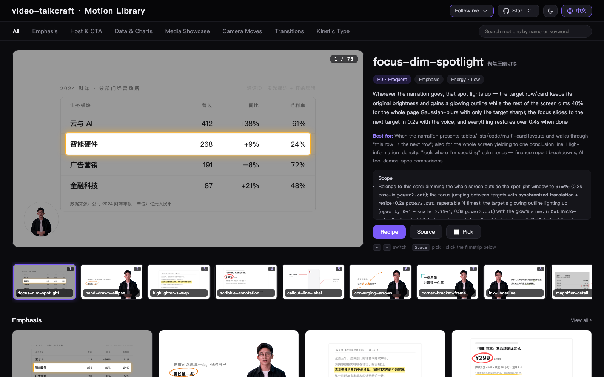

<div align="center">


<h1>video-talkcraft</h1>

[](https://vincentwei1021.github.io/video-talkcraft/)
[](LICENSE)

**An agent skill for crafting high-quality voiceover-driven videos: word-level voiceover sync · 78 motion recipe cards · a 7-layer anti-slideshow shot system · triple-gate QA**

[中文](README.md) | [English](README_EN.md)

</div>

**video-talkcraft** is the voiceover-driven explainer installment of the
[video-shotcraft](https://github.com/Vincentwei1021/video-shotcraft) series:
an AI agent skill that turns Claude Code or Codex into a motion-design studio
for narrated explainer videos. Give it a narration script and a finished
voiceover, and it aligns word-level timestamps locally, storyboards every
semantic beat into a SHOTBOOK, then renders a polished explainer with
[Remotion](https://www.remotion.dev/) — kinetic type, evidence screenshots,
camera moves, plain-cut subtitles, and film-grade SFX, all locked to the voice.

> The methodology docs and recipe cards are written in Chinese — the toolkit is
> built Chinese-narration-first (mixed Chinese/English narration is fully
> supported). Agents read them natively.

🖼️ [**Browse all 78 motion previews in the live Gallery »**](https://vincentwei1021.github.io/video-talkcraft/)

[](https://vincentwei1021.github.io/video-talkcraft/)

## ✨ Highlights

- **Word-level voiceover sync** — `scripts/timestamps_cpu.py` aligns
  your script to the audio (FireRedASR2-CTC int8 by default, faster-whisper as
  the zero-download fallback). Benchmarked against a GPU forced aligner on a
  110s mixed-language narration: median per-character offset 20–40 ms,
  worst case 200 ms, zero false QA flags. Every motion beat anchors to the
  exact word.
- **78 motion recipe cards** — each with intent, parameters, known pitfalls,
  a copy-paste self-contained Remotion tsx source, and a runnable HTML
  preview — browse them all in the
  [online Gallery](https://vincentwei1021.github.io/video-talkcraft/) or
  locally with `open gallery/index.html`. Kinetic type, data shots, evidence
  tours, six motion-carry transitions, a long-take world canvas, host
  compositing, and more.
- **A 7-layer anti-slideshow system** — continuous camera curves, parallax
  planes, idle/yield lifecycle, breathing environment. Statically frozen
  frames are structurally impossible (and automatically detected if they
  slip through).
- **Layout discipline that survives review** — semantic-beat storyboarding,
  on-screen element budgets, whitespace anchors, pivot-sentence cut rules,
  and face safety zones measured by real detection
  (`scripts/face_bbox.py`), not by eye.
- **Triple-gate QA** — automated stillness detection, per-cue SFX energy
  verification on a solo track, and an independent-reviewer pass armed with
  anchor frames and burst triples that catch time-domain defects single
  frames can't show.

## 🚀 Quick start

**The most direct way: hand the repo link to your agent.**
In Claude Code / Codex or a similar agent, just say:

```text
Install this skill for me: https://github.com/Vincentwei1021/video-talkcraft
```

Or install with the [skills](https://skills.sh/) CLI / manually:

```bash
npx skills add Vincentwei1021/video-talkcraft
```

```bash
git clone https://github.com/Vincentwei1021/video-talkcraft.git
cd video-talkcraft
ln -s "$(pwd)" ~/.claude/skills/video-talkcraft   # Claude Code
# or
ln -s "$(pwd)" ~/.codex/skills/video-talkcraft    # Codex
```

Environment (the agent will set this up as needed):

- Node 18+ (Remotion render; `npm install` inside the per-video project)
- Python 3.10+ and `pip install zhconv pypinyin sherpa-onnx soundfile numpy`
  for the timestamp pipeline (first use downloads the 767 MB FireRedASR2-CTC
  model once — URLs in `scripts/timestamps_cpu.py`; or use
  `--backend whisper` to skip the manual download)
- ffmpeg

Then make requests like:

```text
Use video-talkcraft to turn this narration script + voiceover.wav into a video.
Make a 100-second explainer about <topic>; here is the script and the audio.
```

## 🎞 What you bring vs. what it does

| You bring (inputs) | The skill does |
| --- | --- |
| Narration script | Word-level timestamp alignment, with per-sentence QA flags |
| Finished voiceover — any TTS or human recording | SHOTBOOK storyboarding: semantic beats, layer matrices, layout budgets |
| Optional host footage — ordinary video works (keying + face-zone tooling included; green screen keys cleanest) | Remotion implementation on four global systems (camera / parallax / yield / environment), transitions, SFX placement |
| Optional B-roll / screenshots | Render + triple-gate QA loop until clean, loudness-normalized delivery |

## 📦 What's included

| Content | Description |
| --- | --- |
| 78 motion recipe cards | Intent, energy, parameters, implementation notes, and known pitfalls — every card ships a self-contained Remotion tsx source (`template/cards/`, copy one file and go) plus a runnable HTML demo |
| Gallery | [Online](https://vincentwei1021.github.io/video-talkcraft/) or local (`open gallery/index.html`) — browse and autoplay all 78 previews, search by name/keyword |
| Motion systems | CameraRig, parallax planes, idle/yield lifecycle, environment layer, six transitions, long-take world canvas (`template/motion-systems/`) |
| Components | Plain-cut subtitles, flower-word titles, smash words, highlight sweeps, pencil draw, number rolls (`template/components/`) |
| Pipeline scripts | Word-level timestamps (2 ASR backends), face-zone detection, stillness check, SFX presence check, QA frame extraction (`scripts/`) |
| Methodology | Design language (Apple-paradigm default), shot design worksheets, cinematography rules, storyboard format, QA rubrics (`references/`) |
| Embedded SFX | Per-card sound cue tables with real samples embedded in the demo lib (licenses in `demos/_lib/sfx/ATTRIBUTION.md`) |

## 🗂 Repository structure

```text
video-talkcraft/
├── SKILL.md                    # Agent entry point: the 8-step pipeline and hard rules
├── references/
│   ├── design-language.md      # Default visual system (palette/type/layout/subtitles)
│   ├── shot-design.md          # 3-plane worksheet + 7 shot-type presets
│   ├── cinematography.md       # 7-layer model, transitions, layout budget, QA gates
│   ├── shotbook-example.md     # A full storyboard example
│   ├── cards/                  # 78 motion recipe cards
│   ├── taxonomy.md             # Card index by category and source
│   ├── broll-sources.md        # Attribution-free stock sources (APIs, license traps)
│   ├── host-footage.md         # Host footage: input spec, keying, face safety zone
│   └── demo-spec.md            # Card/demo authoring spec
├── demos/                      # 78 runnable HTML previews (+ shared lib with embedded SFX)
├── gallery/                    # One-page local gallery
├── template/                   # Copy-paste Remotion code
│   ├── cards/                  # Per-card self-contained tsx sources (the skill's primary reference)
│   ├── motion-systems/         # Camera / parallax / yield / environment / transitions / long-take
│   └── components/             # Subtitles, flower words, smash words, pencil, etc.
└── scripts/                    # Timestamps, face bbox, QA tooling
```

For the full workflow, start at [SKILL.md](SKILL.md).

## ❓ FAQ

**What is video-talkcraft?**
An open-source AI agent skill (for Claude Code / Codex) that turns a narration
script plus a finished voiceover into a fully animated, voiceover-driven
explainer video. It is
not an editor and not a template site — the agent reads the methodology, picks
motion recipe cards, writes [Remotion](https://www.remotion.dev/) code, and
runs triple-gate QA to deliver a publish-ready explainer.

**What kinds of videos can it make?**
Landscape, voiceover-driven explainer videos: knowledge explainers, product
reviews, news breakdowns, opinion commentary. Designed Chinese-narration-first; mixed
Chinese/English narration is fully supported.

**What do I need to provide?**
A narration script (text) and a finished voiceover (any TTS or human
recording); host footage and B-roll are optional.

**Is it free?**
Free for personal, educational, and research use (PolyForm Noncommercial
1.0.0), and the videos you produce belong to you; commercial use of the
toolkit itself requires prior authorization (see below).

## 📄 License

[PolyForm Noncommercial 1.0.0](LICENSE) — free for personal, educational, and
research use. **Any commercial use of the toolkit requires prior
authorization** — email
[vincentwei1021@gmail.com](mailto:vincentwei1021@gmail.com) or open
a GitHub issue.

**Videos you produce with this skill belong to you.** If it helped, a mention
of the author's accounts in your video description is appreciated — and
entirely optional.

## 🔊 Audio and asset notes

- Embedded SFX samples: sources and licenses in
  [demos/_lib/sfx/ATTRIBUTION.md](demos/_lib/sfx/ATTRIBUTION.md).
- The B-roll sourcing guide only admits attribution-free stock (Pexels,
  Pixabay, Mixkit Free, Coverr, NASA) and documents the license traps of the
  ones it rejects — see
  [references/broll-sources.md](references/broll-sources.md).
- The demo host footage (`demos/_lib/dh-host.webm`) is an AI-generated
  presenter used as a placeholder; replace it with your own host footage in
  production.

## 🙏 Acknowledgements

- **[Remotion](https://www.remotion.dev/)** — the React video framework
  powering every render here (note its own
  [license](https://github.com/remotion-dev/remotion/blob/main/LICENSE.md)).
- **[FireRedASR2](https://github.com/FireRedTeam/FireRedASR2S)** via
  **[sherpa-onnx](https://github.com/k2-fsa/sherpa-onnx)** and
  **[faster-whisper](https://github.com/SYSTRAN/faster-whisper)** — the
  timestamp backends; **Qwen3-ASR/ForcedAligner** served as the benchmarking
  reference.
- **OpenCV YuNet** — the face detector behind the face-safety-zone rule.
- **Pexels · Pixabay · NASA · Mixkit** — attribution-free asset sources.
- **Claude Code** — this library was built, iterated, and QA'd with an AI
  coding agent, using the same review loops the skill teaches.

## Follow me

<p>
  <a href="https://x.com/VincentWei93"></a>
  <a href="https://www.douyin.com/user/MS4wLjABAAAAK1pkjBxilk2Oi_9h_vFyD-lTAu9CTlvhmOtkosDvvxg"></a>
  <a href="https://xhslink.cn/m/At9iP2d5C1V"></a>
</p>
